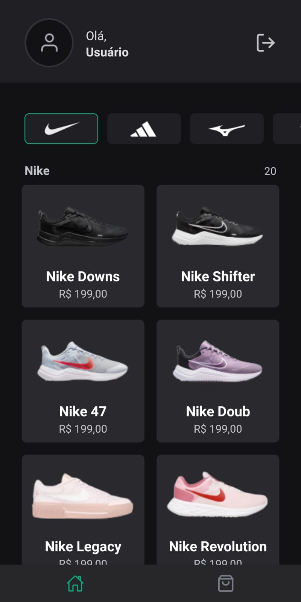
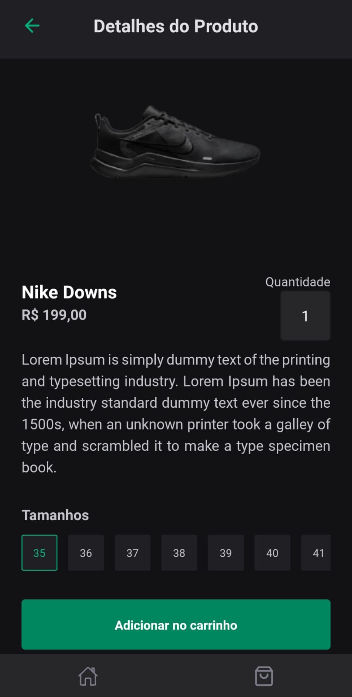
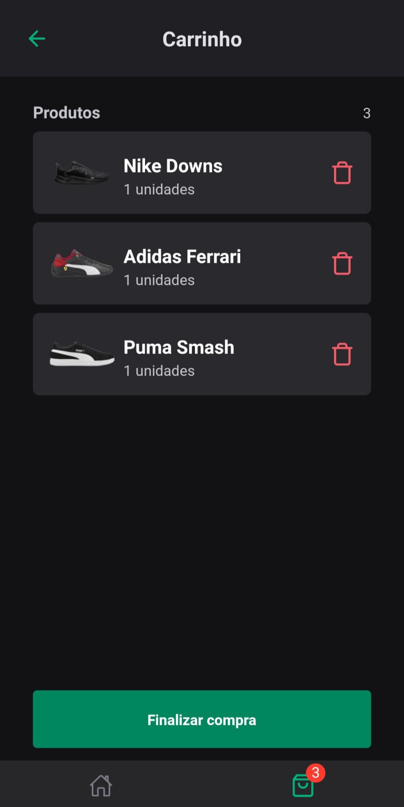

# Ignite-Shoes-App

Ignite-Shoes-App is a shoe store mobile app, organized by brands such as Nike, Adidas, Mizuno, and others. It was developed using the Expo bare workflow, React Native, and TypeScript. The base code was provided by Rocketseat Education, and the push notifications and deep linking functionality were implemented by me.

## Table of Contents

- [Features](#features)
- [Installation](#installation)
- [Usage](#usage)
- [Screenshots](#screenshots)
- [Technologies](#technologies)
- [Disclaimer](#disclaimer)

## Features

- Simulate Shoes Store App
- Browse shoes by brand
- Simple and intuitive user interface
- Receive push notifications for new shoes and promotions
- Deep link to specific shoes from notifications

## Installation

To get started with IgniteShoesApp, you'll need to have Expo CLI installed on your machine. Once you have it installed, 
you can clone the repository and install the dependencies:

1. git clone this repository
2. cd igniteshoesapp
3. `npm install` to install dependencies
4. On myconfig.js file insert your API Key on const OneSignalKey
5. Build the app `expo build:android` if android or `expo build:ios`. 
6. Once the build process is complete, you will receive a link to download the APK file or iOS build. Download and install the app on your device.
7. Start the development server by running the following command: `expo start`
8. Open the Expo Go app on your mobile device and scan the QR code displayed in the Expo developer tools in your web browser. This will launch the app on your device using a development build.

## Usage

1. After instalation just run the app with `expo start`

2. Use your mobile device to scan the QR code displayed in the terminal or in the Expo Dev Tools.

3. The app should now be running on your device, use development build.

## Screenshots

Here are some screenshots of the project:

    
Click to view images

    <h2>Home</h2>
    
    <h2 style="margin-top: 50px">Product</h2>
    
    <h2 style="margin-top: 50px">Chart</h2>
    
    

## Technologies

- Expo
- React Native
- TypeScript
- NativeBase
- OneSignal Expo Plugin
- React Navigation
- Async Storage
- SVG
- Safe Area Context
- React Native Screens
- Expo Google Fonts
- Expo Font
- Expo Status Bar
- Expo Splash Screen
- Expo Dev Client
- Expo Linking
- Babel Core
- TypeScript
- @types/react
- @types/react-native

## Disclaimer

This project's design and code was provided by [@Rocketseat](https://github.com/Rocketseat) as part of the Ignite course. In this project I developed deep linking and push notifications.  